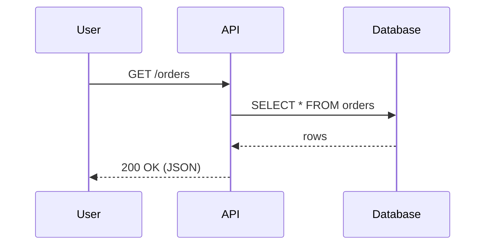
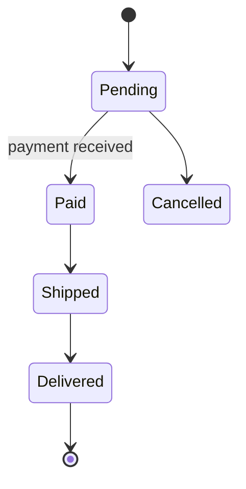

# Example: Markdown with several diagrams

Every ```` ```mermaid ```` block in a Markdown file opens as its own tab.
Edits are written back into the right block when you save.

## Request flow



## Order states


